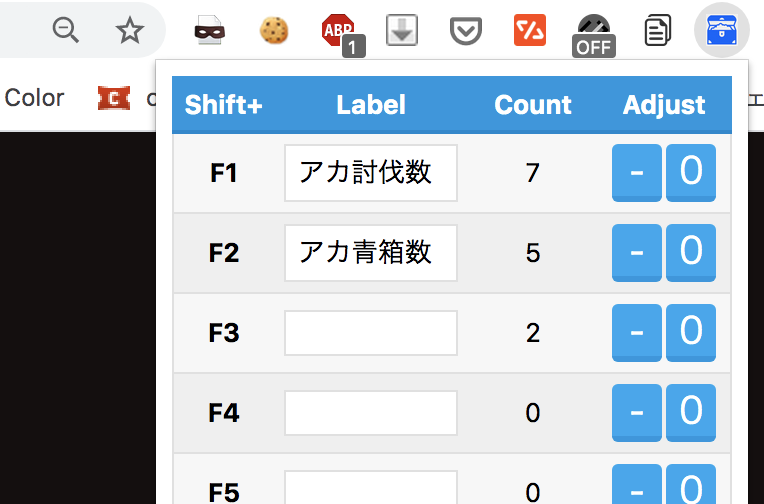

# GBF DropCounter Extension

 

`Shift + FuncionKey` が押された回数をカウントします。 
「討伐のリザルトを見た」「青箱の獲得を確認した」
このようなタイミングでキーを押してカウントを増やして使います。 
自動でカウントするのではなくアナログ。 

 

キーが正しく認識されてカウントが増えると、音が鳴ります。 
拡張アイコンを押すと現在のカウント数が表示され、減算及び初期化(0にする)ができます。 
